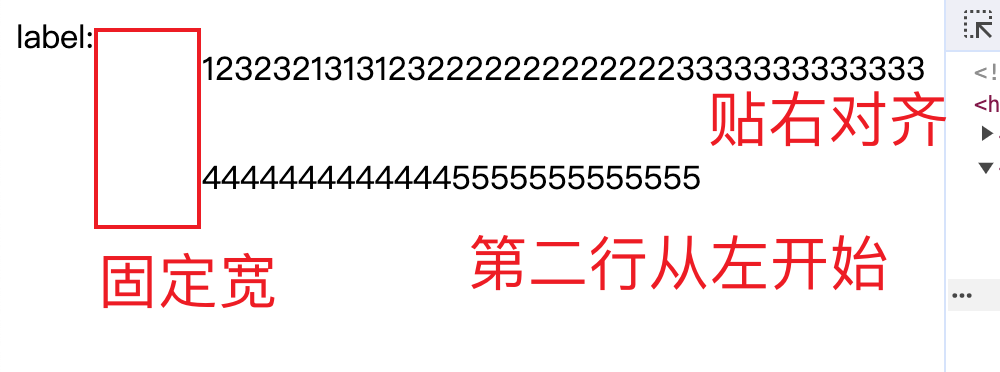

## css有趣属性介绍
### mix-blend-mode 混合模式
- 不仅各个图像之间要进行混合，同时还要和背景色进行混合。
Demo: 
```css
div {
  height: 100vh;
  background: linear-gradient(45deg, #000 0, #000 50%, #fff 50%);
}

div::before {
  content: "LOREM IPSUM";
  position: absolute;
  top: 50%;
  left: 50%;
  transform: translate(-50%, -50%);
  color: #fff;
  mix-blend-mode: hard-light;
  animation: move 3s infinite linear alternate;
}

@keyframes move {
  0% {
    transform: translate(-30%, -50%);
  }
  100% {
    transform: translate(-70%, -50%);
  }
}
```

### css vh单位理解
1. 如果是在 iframe 中，vh的高度是以 iframe 的高度为准的。
2. zoom 属性会影响 vh的计算。


contenteditable


## 一些实用布局展示
### 要求如图



```css
.box {
  display: flex;
  justify-content: space-between;
}
.empty-box {
  width: 54px;
  height: 2px;
  min-width: 54px;
}
.list {
  display: flex;
  flex-wrap: wrap;
}
```
```html
<div class="box">
  <div class="label">label:</div>
  <div class="empty-box"></div>
  <div class="list">
    <p>1232321313123</p>
    <p>2222222222222</p>
    <p>3333333333333</p>
    <p>4444444444444</p>
    <p>5555555555555</p>
  </div>
</div>
```

