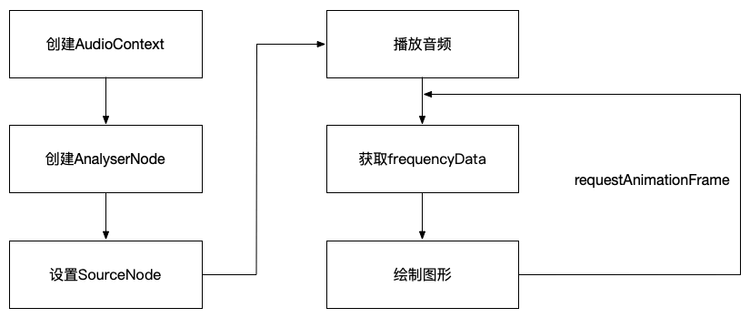
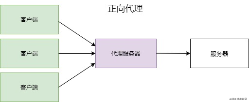
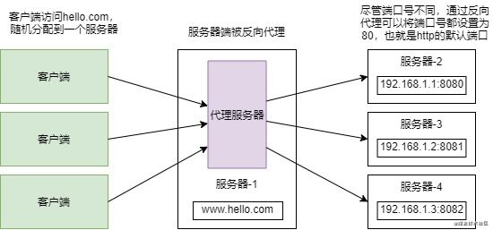

## 异或
what：异或是通过比较二进制位的值，相同位0，不同为1。
- 结合律 (a ^ b) ^ c = a ^ (b ^ c);
- 交换律 a ^ b = b ^ a;

特别的：⬇️
- 异或自己的结果为0：a ^ a = 0；
- 异或0的结果还是自己本身：a ^ 0 = a；
- 异或-1的结果为自身的值按位取反值：a ^ -1 = ~a

**一些例子**
```js
// 交换x 和 y的值，因为js没有指针所以只能通过对象修改
function exchange (obj) {
  obj.y = obj.x ^ obj.y
  obj.x = obj.x ^ obj.y
  obj.y = obj.x ^ obj.y
}

// 给定一个非空整数数组，除了某个元素只出现一次以外，其余每个元素均出现两次。找出那个只出现了一次的元素
function findOne(nums) {
  let res = 0
  nums.forEach(el => {
    res ^= el
  });
  return res
}
```
## websocket
在`websocket`之前实现的两种方式：
1. 轮询：让浏览器每间隔几秒，就发送一次请求。
    问题：( 需要服务器有很快的处理速度和资源 )
2. long pull：采取的是阻塞模式的轮询，没收到消息就不返回，直到有消息返回才再次建立新链接。
    问题：( 需要有很高的并发，也就是说同时接待客户的能力 )


## 音频相关
#### 需求1: 需要前端校验 上传音频 是否符合 8k 16bit 的要求
<b> 补充知识：⬇️ </b>
 - 采样频率： 在一定时间内将连续的模拟信号采样多少次。一般我们说48k采样率，即为1S内采样48000个点，每2个采样点之间时间为1/48000S，即为1/48Ms，也就是1Ms内有48个点。
 
 - 采样位深： 在每次采样时，每个点的数据存储为多少bit。音频在数字信号中，振幅范围为[-1,1]，也可以把采样位深理解为将振幅[-1,1]划分为多少级。举个极端、简单的例子: 
 - - 情况①：采样精度为1时，那么采样到数据为-1,0,1。仅三级。
 - - 情况②：采样精度为0.1时，那么采样到数据为-1,-0.9,-0.8……-0.1,0,0.1……0.8,0.9,1。有21级。所以采样位深越高，所承载的信号的精度越高。

一般我们常看到音频采样位深为16Bit、24Bit。意思是2进制数16位、24位。16位2进制数所能表达的数据范围为-32767-32767。24位2进制数所能表达的数据范围为-8388607~8388607。
<hr />
<b>实际业务：⬇️</b>

业务中，我所要获取的音频源格式为 .wav 格式的音频所涉及的参数，对其位深和采样率进行校验，符合要求的才能上传。

*问题：* 如何找到它对应的存储的信息，获取到 `SampleRate & BitsPerSample`？

<tag name="关键点:" /> 
.wav格式的音频是将其存储在 head 里面的，具体存储规则：详见<a href="https://www.jianshu.com/p/b7cadd3e9c4d" target="_Blank">WAV格式详解</a>，因此如果我们将音频以流的形式读出，根据信息存储就可与你获得到对应的音频信息了。


:::details 解决流程：⬇️
- 1. 将文件以 数据流 的形式读出来。
```js
// File 对象是特殊类型的 Blob，且可以用在任意的 Blob 类型的 context 中。（from ---> MDN）
const buffer = await file.arrayBuffer();
// **** 同理还可以使用 Blob 对象的其它方法 *****
const stream = await file.stream();
```
- 2. 根据信息储存位置读出 所需的信息。
```js {8,14,20}
const head = new WavHead(buffer);
class WavHead {
    constructor(buffer) {
        this.buffer = buffer.slice(0, 80)
    }

    get simpleRate() {
        const rate = new Int32Array(this.buffer.slice(24, 28)).join('');
        console.log('rate:', rate);
        return parseInt(rate);
    }

    get bitsPerSample() {
        const bits = new Int16Array(this.buffer.slice(34, 36)).join('');
        console.log('bits:', bits);
        return parseInt(bits);
    }

    get formType() {
        const type = String.fromCharCode.apply(null, new Uint8Array(this.buffer.slice(8, 12)))
        console.log('type: ', type)
        return type
    }
}
```
:::

<tag name="Demo⬇️" colorType="info"/> 获取 .wav格式音频信息！

⚠️注意：只对wav格式音频起效哦～
<upload />

#### 需求2: 怎么获取视频中的音频源
首先需要明确一点，不同的视频格式文件的存储信息的位置是不同的，要去读文件还要依照文件的存储机制去读写才行。

<tag name="遗留问题" colorType="red"></tag>
校验方式：涉及知识点 => 

1. buffer 怎么转换成 audio 可以识别的录音
2. 音频可视化怎么实现
<hr/>

##### 音频可视化:
[参考文章](https://zhuanlan.zhihu.com/p/84202126)

**前置内容补充（需要提前掌握的内容如下）：**
1. [webAudio](https://developer.mozilla.org/zh-CN/docs/Web/API/Web_Audio_API) 目的：如何获取音频数据。
2. 可视化图形展示：两种方式 canvas or webGL。

**实现步骤：**
1. **是什么？**

音频可视化：通过获取频率、波形和其他来自声源的数据，将其转换成图形或图像在屏幕上显示出来，再进行交互处理。

2. **怎么实现？**

流程图：（简单来说，就是取数据 + 映射数据两个过程）


我们先把“取数据”这个问题解决，可以按以下5步操作。
:::tip 如何取数据
1. 创建 AudioContext
作用是：关联音频输入，对音频进行解码、控制音频的播放暂停等基础操作
```js
const context = new(window.AudioContext || window.webkitAudioContext)();
```
2. 创建 AnalyserNode
作用是：获取音频的频率数据（ FrequencyData ）和时域数据（ TimeDomainData ）。从而实现音频的可视化。
```js
const analyser = ctx.createAnalyser();
analyser.fftSize = 512;
// fftSize 的要求是 2 的幂次方，比如 256 、 512 等。数字越大，得到的结果越精细。
// fftSize 决定了 frequencyData 的长度，具体为 fftSize 的一半。
// fftSize range [32, 32768].
```
3. 设置 SourceNode
将音频节点，关联到 AudioContext 上分析
- MediaElementAudioSourceNode 允许将`<audio>`节点直接作为输入，可做到流式播放。(一般采用这种方式)
- AudioBufferSourceNode 通过 xhr 预先将音频文件加载下来，再用 AudioContext 进行解码。
- MediaStreamAudioSourceNode 可以将用户的麦克风作为输入。即通过navigator.getUserMedia获取用户的音频或视频流后，生成音频源。
```js
// 获取<audio>节点
const audio = document.getElementById('audio');
// 通过<audio>节点创建音频源
const source = ctx.createMediaElementSource(audio);
// 将音频源关联到分析器
source.connect(analyser);
// 将分析器关联到输出设备（耳机、扬声器）
analyser.connect(ctx.destination);
```
4. 播放音频 `audio.play()`
5. 获取 frequencyData
```js
const bufferLength = analyser.frequencyBinCount;
const dataArray = new Uint8Array(bufferLength);

analyser.getByteFrequencyData(dataArray);
// 这里可以用两种方式处理:
// -> analyser.getByteFrequencyData
// -> analyser.getFloatFrequencyData
// ---> 两者都是返回 TypedArray ，唯一的区别是精度不同。
```
:::

**可视化方案：** 这里目前只了解了 canvas 所以只对 canvas 方案介绍
<tag name='Demo⬇️' colorType="info"/>
<audioView />


## ArrayBuffer 对象
<knowledgeLine>
<template #content_0>
 原始设计目的，与 WebGL（指浏览器与显卡之间的通信接口）项目有关。为了满足 JavaScript 与显卡之间大量的、实时的数据交换，它们之间的数据通信必须是二进制的。这时要是存在一种机制，直接操作字节，将 4 个字节的 32 位整数，以二进制形式原封不动地送入显卡，脚本的性能就会大幅提升。" 
</template>

<template #content_1>
<strong>ArrayBuffer对象：</strong>
代表内存之中的一段二进制数据，可以通过“视图”进行操作。“视图”部署了数组接口，这意味着，可以用数组的方法操作内存。它不能直接读写，只能通过视图（TypedArray视图和DataView视图)来读写，视图的作用是以指定格式解读二进制数据。

```js
const buf = new ArrayBuffer(32)
```
</template>
 
 <template #content_2>
 <a href='https://developer.mozilla.org/zh-CN/docs/Web/JavaScript/Reference/Global_Objects/ArrayBuffer'>ArrayBuffer-MDN文档链接:</a>
 
 1. **ArrayBuffer.prototype.byteLength** -> byteLength属性，返回所分配的内存区域的字节长度
 2. **ArrayBuffer.prototype.slice()** -> slice方法，允许将内存区域的一部分，拷贝生成一个新的ArrayBuffer对象。
 3. **ArrayBuffer.slice()** -> 静态方法isView，返回一个布尔值，表示参数是否为ArrayBuffer的视图实例。

 ```js
 const buffer = new ArrayBuffer(32);
 buffer.byteLength // 32
 const newBuffer = buffer.slice(0, 10); //截取0-10的位数
 ArrayBuffer.isView(buffer) // false
 ArrayBuffer.isView(new Int32Array(buffer)) // true -> 视图实例
 ```
 
 **小结：** -> ArrayBuffer的基础方法只能截取字节长度，想要将其展示成可以看懂的还要使用，TypedArray视图和DataView视图来读写
</template>

<template #content_3>
 ArrayBuffer有两种视图，一种是TypedArray视图，另一种是DataView视图。前者的数组成员都是同一个数据类型，后者的数组成员可以是不同的数据类型

 [TypedArray 视图](https://developer.mozilla.org/zh-CN/docs/Web/JavaScript/Reference/Global_Objects/TypedArray'): -> 描述了一个底层的二进制数据缓冲区的一个类数组视图（。事实上，没有名为 TypedArray 的全局属性，也没有一个名为 TypedArray 的构造函数。

 [DataView 视图](https://developer.mozilla.org/zh-CN/docs/Web/JavaScript/Reference/Global_Objects/DataView'): -> 视图是一个可以从 二进制ArrayBuffer 对象中读写多种数值类型的底层接口，使用它时，不用考虑不同平台的字节序问题。

 字节序是是吗？后面要补充一下。
</template>
</knowledgeLine>

### 利用视图读取ArrayBuffer
#### TypedArray
TypedArray 视图共有 9 种类型:
- Int8Array：8 位有符号整数，长度 1 个字节。
- Uint8Array：8 位无符号整数，长度 1 个字节。
- Uint8ClampedArray：8 位无符号整数，长度 1 个字节，溢出处理不同。
- Int16Array：16 位有符号整数，长度 2 个字节。
- Uint16Array：16 位无符号整数，长度 2 个字节。
- Int32Array：32 位有符号整数，长度 4 个字节。
- Uint32Array：32 位无符号整数，长度 4 个字节。
- Float32Array：32 位浮点数，长度 4 个字节。
- Float64Array：64 位浮点数，长度 8 个字节。

<tag name="注意点"/>

1. 它们很像普通数组，都有length属性，都能用方括号运算符（[]）获取单个元素，所有数组的方法，在它们上面都能使用
2. TypedArray 数组只是一层视图，本身不储存数据，它的数据都储存在底层的ArrayBuffer对象之中，要获取底层对象必须使用buffer属性。
3. TypedArray 数组没有concat方法
4. Uint8ClampedArray 的视图类型是一种针对 Canvas 元素的专有类型(专门针对颜色)。

#### DataView
1. 先将其转化成为 DataView 视图格式
```js
const buffer = new ArrayBuffer(24);
const dv = new DataView(buffer);
```
2. `DataView` 实例提供 8 个方法读取(写入)内存。
- get(set)Int8：读取(写入) 1 个字节，返回一个 8 位整数。
- get(set)Uint8：读取(写入) 1 个字节，返回一个无符号的 8 位整数。
- get(set)Int16：读取(写入) 2 个字节，返回一个 16 位整数。
- get(set)Uint16：读取(写入) 2 个字节，返回一个无符号的 16 位整数。
- get(set)Int32：读取(写入) 4 个字节，返回一个 32 位整数。
- get(set)Uint32：读取(写入) 4 个字节，返回一个无符号的 32 位整数。
- get(set)Float32：读取(写入) 4 个字节，返回一个 32 位浮点数。
- get(set)Float64：读取(写入) 8 个字节，返回一个 64 位浮点数。

### 操作实例
1. 如何以 arrayBuffer 的形式获取远端文件：
```js
const { data } = await axios('远端地址xxxx', { responseType: 'blob'})
const buffer = await data.arrayBuffer()
```
2. 当远端的 txt 文件出现乱码时：
出现乱码的原因可能是因为：文件的编码方式不是 utf-8，所以要按照 utf-8 的形式读取文件。
```js
const res = await fetch('远端地址xxx')
const blob = await res.blob()
const reader = new FileReader()
reader.onload = function(evt) {
    console.log('解析后的值', evt.target.result);
};
reader.readAsText(blob)
```
3. 利用canvas来压缩图片 ！！

起因：之前遇到过一个需求，上传图片要 前端 压缩至 xx kb以下。

但是：前端如何实现图片压缩呢？查阅资料后发现可以使用 canvas 进行压缩

:::details 实现详情如下
1. 将上传的图片 以 base64 的形式读出来，赋值给 img 的 src 属性
```ts
// 方案一： 是有FileReader API 读文件
const reader = new FileReader()
reader.readAsDataURL(file)
reader.onload = function(e: any) {
    img.src = e.target.result as string
}

// 方案二: 自己转图片信息为 base64
// arrayBuffer 转 Base64 的算法
// --> 这么写是有问题的，太大的图片 第一步转arrayBuffer 的时候可能会栈溢出
const arrayBufferToBase64Img = (buffer: ArrayBuffer):string => {
  const str = String.fromCharCode(...new Uint8Array(buffer))
  return `data:image/jpeg;base64,${window.btoa(str)}`
}
const buffer: ArrayBuffer = await file.arrayBuffer()
img.src = arrayBufferToBase64Img(buffer)
```
2. 在图片加载完成后 获取图片信息，并使用 drawImage() 方法压缩
```ts
// 这里要注意一点，要把onload 事件封装成同步事件 ，否则获取不到压缩完成后的 blob
const imgLoaded = (img: HTMLImageElement):Promise<Blob> => {
    return new Promise((resolve, reject) => {
        img.onload = () => {
            const originWidth = img.width
            const originHeight = img.height
            let targetWidth = Math.round(originWidth / 2),
                targetHeight = Math.round(originHeight / 2);
            canvas.width = targetWidth;
            canvas.height = targetHeight;
            // 清除画布
            ctx.clearRect(0, 0, targetWidth, targetWidth);
            // 图片压缩
            ctx.drawImage(img, 0, 0, targetWidth, targetWidth);
            canvas.toBlob((blob) => {
            resolve(blob)
            }, file.type || 'image/png')
        }
    })
}
```
3. 上诉两部其实已经完成了对图片的压缩功能，因为需求是 “压缩至20kb“，所以需要加入递归判断，图片小于 20kb就行。
```ts
interface ICompressProps {
  file: File | Blob,
  maxSize: number, //单位kb
}
// 压缩图片 函数 如下：⬇️
const compressImg = async(props: ICompressProps) => {
  const canvas = document.createElement('canvas')
  const ctx = canvas.getContext('2d')

  // 递归压缩
  const loop = async (props: ICompressProps) => {
    const {file, maxSize } = props
    const outCondition = maxSize * 1024
    if (file.size <= outCondition) return file
    const img = new Image()
    
    const buffer: ArrayBuffer = await file.arrayBuffer()
    img.src = arrayBufferToBase64Img(buffer)
 
    const imgLoaded = (img: HTMLImageElement):Promise<Blob> => {
      return new Promise((resolve, reject) => {
        img.onload = () => {
          const originWidth = img.width
          const originHeight = img.height
          let targetWidth = Math.round(originWidth / 2),
              targetHeight = Math.round(originHeight / 2);
          canvas.width = targetWidth;
          canvas.height = targetHeight;
          // 清除画布
          ctx.clearRect(0, 0, targetWidth, targetWidth);
          // 图片压缩
          ctx.drawImage(img, 0, 0, targetWidth, targetWidth);
          // toBlob 函数这里有第二个参数要注意以下
            // 如果没有文件类型，可能导致转化成了其它类型图片导致第一次压缩 文件反而变大
          canvas.toBlob((blob) => {
            resolve(blob)
          }, file.type || 'image/png') 
        }
      })
    }

    const compressedBlob = await imgLoaded(img)
    const params: ICompressProps = { file: compressedBlob, maxSize }
    if (compressedBlob.size > outCondition) return loop(params)
    return compressedBlob
  }
  
  // 获取压缩后的 最终 Blob 对象
  const blob = await loop(props)
  // 获取压缩后的 最终 ArrayBuffer 对象
  const bf = await blob.arrayBuffer()
}
```
:::

⬇️下例 Demo 会将 图片压缩至 20kb 及以下
该方法 参考了 [张鑫旭大佬的博客](https://www.zhangxinxu.com/study/201707/js-compress-image-before-upload.html)
<bufferDemo/>

### TypedArray && DataView 区别
ArrayBuffer对象的各种TypedArray视图，是用来向网卡、声卡之类的本机设备传送数据，所以使用本机的字节序就可以了；而DataView视图的设计目的，是用来处理网络设备传来的数据，所以大端字节序或小端字节序是可以自行设定的。

## webpack
**关于 process**

**起因：** 在设计权限控制的时候，想要设置一个开关，在本地开发的时候放开所有的权限。

**开始的做法：** 在CLI中设置 NO_AUTH 值，为 true 时放开权限。

**遇到的问题：** 在实现上诉功能的时候，发现 业务代码中 会报 `process is not define` 的错误，
原因很简单process是 node.js中设置的，浏览器中自然是没有的。但是 查看其它项目时发现有使用 `process.env.NO_AUTH`进行判断的。

**怎么设置呢？** 
在package.json文件中控制变量
```json
"start-na": "NODE_ENV=development NO_AUTH=true node ./server/index.js"
```
在webpack -> plugins里面设置
```js
new webpack.DefinePlugin({
    'process.env.NO_AUTH': !!process.env.NO_AUTH,
})
```
:::tip 注意点
1. 猜测 process.env.NO_AUTH 是以字符串的形式 储存的固定值
所以使用的时候要对整个 process.env.NO_AUTH 使用，只是打印 process 是会报错的

2. 上面的例子是个特例，执行的指令为 `node ./server/index.js`，没有使用webpack，直接使用了 express 搭建的，所以可以直接在前面加变量，若是使用 webpack，需要使用 cross-env 配合 DefinePlugin 一起使用
:::


## 前端性能优化
### 虚拟列表
简单版本的虚拟列表：
<vList></vList>

实现方式：

前提：每行的高度固定的情况可以使用这种方式。
1. 根据 scrollTop `Math.floor(scrollTop / rowHeight)` 算出当前展示的第一个元算的索引是多少。
2. 再根据 `Math.ceil(height / rowHeight)` 算出当前可视区可以展示的个数
3. 使用绝对定位 计算出每个元素 `idx * rowHeight` 的 top值

优化点： 上下快速滑动会出现留白的情况。所以要在上下多保留几个元素。
- `startIndex = Math.max(currIndex - bufferSize, 0)`
- `endIndex = Math.min(currIndex + limit + bufferSize, dataCount - 1)`

每行非定高版本：
<vListFin />

这里因为开始时不知道每一行的高度，所以不能像简易版一样算出虚拟列表的真实高度。但是可以假设每一行的高度，
利用一个假的盒子来填充高度。可视区盒子来展示可见Dom
1. 使用一个数组 `cachedPositions`来存储每一个item 的元素信息包括 `{index, height, bottom}`值，
2. 每次滚动的时候获取 展示列表 `showList` 此时dom节点就会更新，然后就可以获取展示区，真实的Dom信息，
并更新 `cachedPositions` 中的每一个 `bottom` 的最新坐标，当所有元素都被加载，`cachedPositions`
里面就会存储每一个的真实信息。（如果数据量过大，这里的更新频率可以限制一下）
3. 位置定位，采用`translate`而非绝对定位，这样可以直接将整体可视区上下平移。
```js
`translate3d(0,${
  startIndex >= 1
    ? cachedPositions[rect.startIndex - 1].bottom
    : 0
}px,0)`})
```

### 性能分析需要注意的一些点
1. 静态资源是否有卡断（尤其是懒加载的组件）
2. 请求接口是否返回缓慢
3. 监听事件是否太多
4. dom节点是否过多
## 跨域问题

1. 产生跨域的原因：
所谓同源是指：**域名、协议、端口相同** 如果发出去的请求不是本域的，协议官方、域名、端口，任何一个不一样，浏览器就认为是跨域的

2. 限制同源的两个场景
- 一是针对接口的请求：如果不限制 浏览器会自动将cookie附加在HTTP请求的头字段Cookie中，这样一来，这个不法网站就相当于登录了你的账号。（[CSRF攻击方式](https://www.cnblogs.com/hyddd/archive/2009/04/09/1432744.html)）
- 二是针对Dom的查询。如果不限制：就可以通过嵌入`iframe`的方式，嵌入网页查询提交表单的信息

3. 如何判断一个请求是不是跨域请求
当请求头中的 host 和 origin 不一致就是跨域请求


### CORS （跨域资源共享）
[cors 文章参考](http://www.ruanyifeng.com/blog/2016/04/cors.html)

如何实现：
1. 针对于简单请求
- 添加一个 `origin` 字段 **(浏览器发现这次跨源AJAX请求是简单请求，就自动在头信息之中，添加一个Origin字段。)**
  - 如果响应头没有包含 `Access-Control-Allow-Origin` 就出错了。会被 `XMLHttpRequest` 的 `onerror` 回调函数捕获。注意，这种错误无法通过状态码识别，因为HTTP回应的状态码有可能是200。
  - 若成功，则会返回
  ```js
  {
    Access-Control-Allow-Origin: 'http://xxx.com',
    Access-Control-Allow-Credentials: true,
    Access-Control-Expose-Headers: FooBar,
  }
  ```
  `withCredentials`: （发送cookie）前端需要设置 XMLHttpRequest -> `xhr.withCredentials = true`
  要发送Cookie，Access-Control-Allow-Origin就不能设为星号，必须指定明确的、与请求网页一致的域名

2. 非简单请求
非简单请求是那种对服务器有特殊要求的请求，比如请求方法是PUT或DELETE，或者Content-Type字段的类型是application/json。

- 非简单请求的CORS请求，会在正式通信之前，增加一次HTTP查询请求（option）剩下的和简单类似。但是要看一下这些信息
  - `Access-Control-Request-Method`
  - `Access-Control-Request-Headers`

### nginx
1. 为了解决负载均衡问题，使用nginx服务器，把不同的客户端请求分发到不同的服务器（nginx 有一种 ip_hash 策略，它可以获取用户真实ip）

2. 代理方式





**区别：**  正向代理是代理了客户端，而反向代理则是代理服务器端。在有多台服务器分布的情况下，为了能让客户端访问到的IP地址都为同一个网站，就需要使用反向代理。


## 前端存储
前端缓存有两种，
1. 一种是将数据保存在 内存 中，比如 vue中使用的vuex，react中使用的redux 等，这种方式的本质就是一个容器，而这种修改容器中的值，相应的组件也会更新。
2. 另一种是采用本地存储手段 sessionStorage、localStorage、indexDB，非响应式的。

:::details 问题：
研究的目的：针对前端处理较大数据时，能不能减轻内存压力。
- 使用缓存存储：读写寿命高，速度快，内存小。性能依赖内存条。
- 使用本地存储：读写寿命低，速度慢（异步io）,依赖磁盘的读写能力。并且如果用户在使用磁盘读写功能（比如拷贝），可能会导致排队问题不能实时读写数据
:::
#### indexedDB
> 1. 相比 Storage 更加大量的数据。
> 2. 异步操作
> 3. 存在同源限制
> 4. ---- （也许可以结合 web workers 一起使用）(后面再研究一下)

**indexedDB 基础 增删改查 功能 demo 展示**
使用方式：
1. 打开数据库 `window.indexedDB.open()`
2. 在数据库中创建一个对象仓库  
```js
db.createObjectStore("storeName", {
  keyPath: "", // 这是主键
  // autoIncrement: true // 实现自增
});
```
2. 对于增删改查操作
```js
// 1. 首先要启动一个事务，然后选择对应的仓库对象
db
  .transaction([storeName], "readwrite") // 事务对象 指定表格名称和操作模式（"只读"或"读写"）
  .objectStore(storeName) // 仓库对象
```
3. indexedDB 有一个游标的概念，可以使用游标`openCursor`去遍历数据筛选数据
- 并且openCursor可以制定搜素方式 by `IDBKeyRange`

4. 注意点
- 在使用 indexedDB 增删改的时候是异步操作，所以要使用 promise 同步操作。
- 事务（`transaction`）要现开现用, 如果使用全局存储一个事务，需要修改的时候去调用就会报 事务已经结束的错误。

:::details 简单功能封装代码展示
```ts
interface IDBBase {
  dbName: string;
  version: number;
  paramsList: {name: string, uni: boolean}[];
  storeName: string;
  keyPath: string;
}

export default class IndexedDB {
  _dbName: string = 'myDB';
  _dbVersion: number = 1;
  _dbTable: { name: string, uni: boolean}[] = [];
  _db: any = null;
  _storeName: string = '';
  _keyPath: string = '';
  _objectStore: any = null;

  constructor(info: IDBBase) {
    this._dbName = info.dbName;
    this._dbVersion = info.version;
    this._dbTable = info.paramsList;
    this._storeName = info.storeName;
    this._keyPath = info.keyPath

    if (this._db) {
      console.log('已存在打开数据库～～，请关闭')
    }
  }

  public checkIsSupportDB = () => {
    if (!window.indexedDB) {
      console.error('浏览器版本不支持使用')
      return false
    } else {
      return true
    }
  }

  public startObjectStore = () => { // 事务要现开现用，不然事务会结束。
    this._objectStore = this._db.transaction(this._storeName, 'readwrite').objectStore(this._storeName)
  }

  public handleErrorMsg = (err: any) => {
    if (err.type === "error") {
      console.log(err.srcElement.error);
    }
  }

  public handleSingleAdd = (data: any) => {
    return new Promise((resolve, reject) => {
      this.startObjectStore()
      const request = this._objectStore.add(data)
      
      request.onsuccess = () => {
        console.log('数据添加成功');
        resolve(true)
      }
  
      request.onerror = (err) => {
        console.log('数据添加失败');
        this.handleErrorMsg(err)
        reject(false)
      }
    })
  }

  public openDB = () => {
    if (!this.checkIsSupportDB()) return
    return new Promise ((resolve, reject) => {
      const indexDB = window.indexedDB
      const request = indexDB.open(this._dbName, this._dbVersion)
  
      request.onsuccess = (event) => {
        console.log("数据库打开成功");
        resolve(event.target.result)
        this._db = event.target.result
      }
  
      request.onerror = (err) => {
        console.log("数据库打开失败", err);
        reject(null)
        this._db = null
      }
  
      // 数据库更新时的回调
      request.onupgradeneeded = (event) => {
        console.log('数据库更新');
        this._db = event.target.result;
  
        const objectStore = this._db.createObjectStore(this._storeName, {
          keyPath: this._keyPath,
        })
  
        this._dbTable.forEach(i => {
          objectStore.createIndex(i.name, i.name, { unique: i.uni }); 
        })
      }
  
      // 在其他标签页打开了该数据库 触发
      request.onblocked = () => {
        alert("请关闭其它由该站点打开的页签")
      }
    })
  }

  public addData = (data: any[]) => {
    return new Promise(async(resolve, reject) => {
      this.startObjectStore()
      const passIds = []
      const failedIds = []

      for (const item of data) {
        try {
          await this.handleSingleAdd(item)
          passIds.push(item.ssn)
        } catch (error) {
          failedIds.push(item.ssn)
        }
      }
      resolve({
        passIds, failedIds,
        allPassed: failedIds.length <= 0
      })
    })
  }

  // 按主键删除
  public delData = (key: string) => {
    return new Promise((resolve, reject) => {
      this.startObjectStore()
      const request = this._objectStore.delete(key)
      
      request.onsuccess = () => {
        console.log('数据删除成功');
        resolve(true)
      }

      request.onerror = () => {
        console.log('数据删除失败');
        reject(false)
      }
    })
  }

  public updateData = (data: any) => {
    return new Promise((resolve, reject) => {
      this.startObjectStore()
      const request = this._objectStore.put(data)
      
      request.onsuccess = () => {
        console.log('数据更新成功');
        resolve(true)
      }
  
      request.onerror = () => {
        console.log('数据更新失败');
        reject(false)
      }
    })
  }

  public findElByIndex = (idx: string, searchName: string) => {
    return new Promise((resolve, reject) => {
      const list = []
      this.startObjectStore()
      const request = this._objectStore.index(idx).openCursor(IDBKeyRange.only(searchName))
  
      request.onsuccess = (e) => {
        const cursor = e.target.result
        if (cursor) {
          list.push(cursor.value)
          cursor.continue()
        } else {
          resolve(list)
        }
      }
    })
  }

  public queryAllData = () => {
    return new Promise<any[]>((resolve, reject) => {
      this.startObjectStore()
      const list = []

      // 1. 获取全部数据 
      this._objectStore.getAll().onsuccess = (event) => {
        resolve(event.target.result)
      }
    })
  }

  public queryCustomCondition = (callback: (params: object) => boolean) => {
    return new Promise<any[]>((resolve, reject) => {
      this.startObjectStore()
      const list = []
  
      this._objectStore.openCursor().onsuccess = (event) => {
        const cursor = event.target.result
        if (cursor) {
          callback(cursor.value) && list.push(cursor.value)
          cursor.continue();
        } else {
          resolve(list)
        }
      }
    })
  }

  public closeDB = () => {
    this._db.close()
    this._db = null
  }
}
```
:::

<indexDB/>


