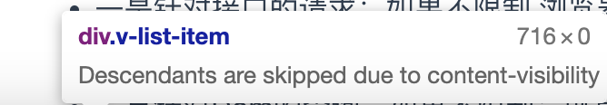

## 异或
what：异或是通过比较二进制位的值，相同位0，不同为1。
- 结合律 (a ^ b) ^ c = a ^ (b ^ c);
- 交换律 a ^ b = b ^ a;

特别的：⬇️
- 异或自己的结果为0：a ^ a = 0；
- 异或0的结果还是自己本身：a ^ 0 = a；
- 异或-1的结果为自身的值按位取反值：a ^ -1 = ~a

**一些例子**
```js
// 交换x 和 y的值，因为js没有指针所以只能通过对象修改
function exchange (obj) {
  obj.y = obj.x ^ obj.y
  obj.x = obj.x ^ obj.y
  obj.y = obj.x ^ obj.y
}

// 给定一个非空整数数组，除了某个元素只出现一次以外，其余每个元素均出现两次。找出那个只出现了一次的元素
function findOne(nums) {
  let res = 0
  nums.forEach(el => {
    res ^= el
  });
  return res
}
```
## websocket
在`websocket`之前实现的两种方式：
1. 轮询：让浏览器每间隔几秒，就发送一次请求。
    问题：( 需要服务器有很快的处理速度和资源 )
2. long pull：采取的是阻塞模式的轮询，没收到消息就不返回，直到有消息返回才再次建立新链接。
    问题：( 需要有很高的并发，也就是说同时接待客户的能力 )


## 音频相关
### 校验上传音频位深，采样率
<b> 补充知识：⬇️ </b>
 - 采样频率： 在一定时间内将连续的模拟信号采样多少次。一般我们说48k采样率，即为1S内采样48000个点，每2个采样点之间时间为1/48000S，即为1/48Ms，也就是1Ms内有48个点。
 
 - 采样位深： 在每次采样时，每个点的数据存储为多少bit。音频在数字信号中，振幅范围为[-1,1]，也可以把采样位深理解为将振幅[-1,1]划分为多少级。举个极端、简单的例子: 
 - - 情况①：采样精度为1时，那么采样到数据为-1,0,1。仅三级。
 - - 情况②：采样精度为0.1时，那么采样到数据为-1,-0.9,-0.8……-0.1,0,0.1……0.8,0.9,1。有21级。所以采样位深越高，所承载的信号的精度越高。

一般我们常看到音频采样位深为16Bit、24Bit。意思是2进制数16位、24位。16位2进制数所能表达的数据范围为-32767-32767。24位2进制数所能表达的数据范围为-8388607~8388607。
<hr />
<b>实际业务：⬇️</b>

业务中，我所要获取的音频源格式为 .wav 格式的音频所涉及的参数，对其位深和采样率进行校验，符合要求的才能上传。

*问题：* 如何找到它对应的存储的信息，获取到 `SampleRate & BitsPerSample`？

<tag name="关键点:" /> 
.wav格式的音频是将其存储在 head 里面的，具体存储规则：详见<a href="https://www.jianshu.com/p/b7cadd3e9c4d" target="_Blank">WAV格式详解</a>，因此如果我们将音频以流的形式读出，根据信息存储就可与你获得到对应的音频信息了。


:::details 解决流程：⬇️
- 1. 将文件以 数据流 的形式读出来。
```js
// File 对象是特殊类型的 Blob，且可以用在任意的 Blob 类型的 context 中。（from ---> MDN）
const buffer = await file.arrayBuffer();
// **** 同理还可以使用 Blob 对象的其它方法 *****
const stream = await file.stream();
```
- 2. 根据信息储存位置读出 所需的信息。
```js {8,14,20}
const head = new WavHead(buffer);
class WavHead {
    constructor(buffer) {
        this.buffer = buffer.slice(0, 80)
    }

    get simpleRate() {
        const rate = new Int32Array(this.buffer.slice(24, 28)).join('');
        console.log('rate:', rate);
        return parseInt(rate);
    }

    get bitsPerSample() {
        const bits = new Int16Array(this.buffer.slice(34, 36)).join('');
        console.log('bits:', bits);
        return parseInt(bits);
    }

    get formType() {
        const type = String.fromCharCode.apply(null, new Uint8Array(this.buffer.slice(8, 12)))
        console.log('type: ', type)
        return type
    }
}
```
:::

<tag name="Demo⬇️" colorType="info"/> 获取 .wav格式音频信息！

⚠️注意：只对wav格式音频起效哦～
<upload />

### 怎么获取视频中的音频源
获取视频中的音频源，需要涉及到的知识点是 **`web audio api`**

而关于该API需要的基础知识很多，这里不深入讲解。知识点详解 [audioApi详情](./webAudioApi.md)

:::details
**这里补充几点**
1. AudioContext.decodeAudioData() 
  - 方法可用于异步解码音频文件中的 `ArrayBuffer`。`ArrayBuffer` 数据可以通过 `XMLHttpRequest` 和 `FileReader` 来获取。
  - 也可以将 `videoBuffer` 中的音轨提取出来。
:::


下面示例为分离展示：

```ts
const changeFile = (e: InputEvent) => {
  const offlineAudioContext = new OfflineAudioContext(2, 44100 * 100, 44100);
  const soundSource = offlineAudioContext.createBufferSource();

  const audioContext = new(window.AudioContext || window.webkitAudioContext)();
  const reader = new FileReader();

  const blob = new Blob([e.target.files[0]]);

  reader.readAsArrayBuffer(blob); // video file
  reader.onload = function () {
    const videoFileAsBuffer = reader.result; // arraybuffer
    
    audioContext.decodeAudioData(videoFileAsBuffer).then(function (decodedAudioData) {
      let myBuffer = decodedAudioData;
      soundSource.buffer = myBuffer;
      soundSource.connect(offlineAudioContext.destination);
      soundSource.start();
      
      offlineAudioContext.startRendering().then(function (renderedBuffer) {
        const wav = toWav(renderedBuffer) // 这里使用了一个 audiobuffer-to-wav 的包进行了audiobuffer 转化成为 wav 格式文件。
        url.value = URL.createObjectURL(new Blob([new Uint8Array(wav)]))

      }).catch(function (err) {
        console.log('Rendering failed: ' + err);
      });
    });
  };
}
```
<videoDemo/>

<hr/>

### 音频可视化
[参考文章](https://zhuanlan.zhihu.com/p/84202126)

**前置内容补充（需要提前掌握的内容如下）：**
1. [webAudio](https://developer.mozilla.org/zh-CN/docs/Web/API/Web_Audio_API) 目的：如何获取音频数据。
2. 可视化图形展示：两种方式 canvas or webGL。

**实现步骤：**
1. **是什么？**

音频可视化：通过获取频率、波形和其他来自声源的数据，将其转换成图形或图像在屏幕上显示出来，再进行交互处理。

2. **怎么实现？**

流程图：（简单来说，就是取数据 + 映射数据两个过程）


我们先把“取数据”这个问题解决，可以按以下5步操作。
:::tip 如何取数据
1. 创建 AudioContext
作用是：关联音频输入，对音频进行解码、控制音频的播放暂停等基础操作
```js
const context = new(window.AudioContext || window.webkitAudioContext)();
```
2. 创建 AnalyserNode
作用是：获取音频的频率数据（ FrequencyData ）和时域数据（ TimeDomainData ）。从而实现音频的可视化。
```js
const analyser = ctx.createAnalyser();
analyser.fftSize = 512;
// fftSize 的要求是 2 的幂次方，比如 256 、 512 等。数字越大，得到的结果越精细。
// fftSize 决定了 frequencyData 的长度，具体为 fftSize 的一半。
// fftSize range [32, 32768].
```
3. 设置 SourceNode
将音频节点，关联到 AudioContext 上分析
- MediaElementAudioSourceNode 允许将`<audio>`节点直接作为输入，可做到流式播放。(一般采用这种方式)
- AudioBufferSourceNode 通过 xhr 预先将音频文件加载下来，再用 AudioContext 进行解码。
- MediaStreamAudioSourceNode 可以将用户的麦克风作为输入。即通过navigator.getUserMedia获取用户的音频或视频流后，生成音频源。
```js
// 获取<audio>节点
const audio = document.getElementById('audio');
// 通过<audio>节点创建音频源
const source = ctx.createMediaElementSource(audio);
// 将音频源关联到分析器
source.connect(analyser);
// 将分析器关联到输出设备（耳机、扬声器）
analyser.connect(ctx.destination);
```
4. 播放音频 `audio.play()`
5. 获取 frequencyData
```js
const bufferLength = analyser.frequencyBinCount;
const dataArray = new Uint8Array(bufferLength);

analyser.getByteFrequencyData(dataArray);
// 这里可以用两种方式处理:
// -> analyser.getByteFrequencyData
// -> analyser.getFloatFrequencyData
// ---> 两者都是返回 TypedArray ，唯一的区别是精度不同。
```
:::

**可视化方案：** 这里目前只了解了 canvas 所以只对 canvas 方案介绍
<tag name='Demo⬇️' colorType="info"/>
<audioView />


## ArrayBuffer 对象
<knowledgeLine>
<template #content_0>
 原始设计目的，与 WebGL（指浏览器与显卡之间的通信接口）项目有关。为了满足 JavaScript 与显卡之间大量的、实时的数据交换，它们之间的数据通信必须是二进制的。这时要是存在一种机制，直接操作字节，将 4 个字节的 32 位整数，以二进制形式原封不动地送入显卡，脚本的性能就会大幅提升。" 
</template>

<template #content_1>
<strong>ArrayBuffer对象：</strong>
代表内存之中的一段二进制数据，可以通过“视图”进行操作。“视图”部署了数组接口，这意味着，可以用数组的方法操作内存。它不能直接读写，只能通过视图（TypedArray视图和DataView视图)来读写，视图的作用是以指定格式解读二进制数据。

```js
const buf = new ArrayBuffer(32)
```
</template>
 
 <template #content_2>
 <a href='https://developer.mozilla.org/zh-CN/docs/Web/JavaScript/Reference/Global_Objects/ArrayBuffer'>ArrayBuffer-MDN文档链接:</a>
 
 1. **ArrayBuffer.prototype.byteLength** -> byteLength属性，返回所分配的内存区域的字节长度
 2. **ArrayBuffer.prototype.slice()** -> slice方法，允许将内存区域的一部分，拷贝生成一个新的ArrayBuffer对象。
 3. **ArrayBuffer.slice()** -> 静态方法isView，返回一个布尔值，表示参数是否为ArrayBuffer的视图实例。

 ```js
 const buffer = new ArrayBuffer(32);
 buffer.byteLength // 32
 const newBuffer = buffer.slice(0, 10); //截取0-10的位数
 ArrayBuffer.isView(buffer) // false
 ArrayBuffer.isView(new Int32Array(buffer)) // true -> 视图实例
 ```
 
 **小结：** -> ArrayBuffer的基础方法只能截取字节长度，想要将其展示成可以看懂的还要使用，TypedArray视图和DataView视图来读写
</template>

<template #content_3>
 ArrayBuffer有两种视图，一种是TypedArray视图，另一种是DataView视图。前者的数组成员都是同一个数据类型，后者的数组成员可以是不同的数据类型

 [TypedArray 视图](https://developer.mozilla.org/zh-CN/docs/Web/JavaScript/Reference/Global_Objects/TypedArray'): -> 描述了一个底层的二进制数据缓冲区的一个类数组视图（。事实上，没有名为 TypedArray 的全局属性，也没有一个名为 TypedArray 的构造函数。

 [DataView 视图](https://developer.mozilla.org/zh-CN/docs/Web/JavaScript/Reference/Global_Objects/DataView'): -> 视图是一个可以从 二进制ArrayBuffer 对象中读写多种数值类型的底层接口，使用它时，不用考虑不同平台的字节序问题。

 字节序是是吗？后面要补充一下。
</template>
</knowledgeLine>

### 利用视图读取ArrayBuffer
#### TypedArray
TypedArray 视图共有 9 种类型:
- Int8Array：8 位有符号整数，长度 1 个字节。
- Uint8Array：8 位无符号整数，长度 1 个字节。
- Uint8ClampedArray：8 位无符号整数，长度 1 个字节，溢出处理不同。
- Int16Array：16 位有符号整数，长度 2 个字节。
- Uint16Array：16 位无符号整数，长度 2 个字节。
- Int32Array：32 位有符号整数，长度 4 个字节。
- Uint32Array：32 位无符号整数，长度 4 个字节。
- Float32Array：32 位浮点数，长度 4 个字节。
- Float64Array：64 位浮点数，长度 8 个字节。

<tag name="注意点"/>

1. 它们很像普通数组，都有length属性，都能用方括号运算符（[]）获取单个元素，所有数组的方法，在它们上面都能使用
2. TypedArray 数组只是一层视图，本身不储存数据，它的数据都储存在底层的ArrayBuffer对象之中，要获取底层对象必须使用buffer属性。
3. TypedArray 数组没有concat方法
4. Uint8ClampedArray 的视图类型是一种针对 Canvas 元素的专有类型(专门针对颜色)。

#### DataView
1. 先将其转化成为 DataView 视图格式
```js
const buffer = new ArrayBuffer(24);
const dv = new DataView(buffer);
```
2. `DataView` 实例提供 8 个方法读取(写入)内存。
- get(set)Int8：读取(写入) 1 个字节，返回一个 8 位整数。
- get(set)Uint8：读取(写入) 1 个字节，返回一个无符号的 8 位整数。
- get(set)Int16：读取(写入) 2 个字节，返回一个 16 位整数。
- get(set)Uint16：读取(写入) 2 个字节，返回一个无符号的 16 位整数。
- get(set)Int32：读取(写入) 4 个字节，返回一个 32 位整数。
- get(set)Uint32：读取(写入) 4 个字节，返回一个无符号的 32 位整数。
- get(set)Float32：读取(写入) 4 个字节，返回一个 32 位浮点数。
- get(set)Float64：读取(写入) 8 个字节，返回一个 64 位浮点数。

### 操作实例
1. 如何以 arrayBuffer 的形式获取远端文件：
```js
const { data } = await axios('远端地址xxxx', { responseType: 'blob'})
const buffer = await data.arrayBuffer()
```
2. 当远端的 txt 文件出现乱码时：
出现乱码的原因可能是因为：文件的编码方式不是 utf-8，所以要按照 utf-8 的形式读取文件。
```js
const res = await fetch('远端地址xxx')
const blob = await res.blob()
const reader = new FileReader()
reader.onload = function(evt) {
    console.log('解析后的值', evt.target.result);
};
reader.readAsText(blob)
```
3. 利用canvas来压缩图片 ！！

起因：之前遇到过一个需求，上传图片要 前端 压缩至 xx kb以下。

但是：前端如何实现图片压缩呢？查阅资料后发现可以使用 canvas 进行压缩

:::details 实现详情如下
1. 将上传的图片 以 base64 的形式读出来，赋值给 img 的 src 属性
```ts
// 方案一： 是有FileReader API 读文件
const reader = new FileReader()
reader.readAsDataURL(file)
reader.onload = function(e: any) {
    img.src = e.target.result as string
}

// 方案二: 自己转图片信息为 base64
// arrayBuffer 转 Base64 的算法
// --> 这么写是有问题的，太大的图片 第一步转arrayBuffer 的时候可能会栈溢出
const arrayBufferToBase64Img = (buffer: ArrayBuffer):string => {
  const str = String.fromCharCode(...new Uint8Array(buffer))
  return `data:image/jpeg;base64,${window.btoa(str)}`
}
const buffer: ArrayBuffer = await file.arrayBuffer()
img.src = arrayBufferToBase64Img(buffer)
```
2. 在图片加载完成后 获取图片信息，并使用 drawImage() 方法压缩
```ts
// 这里要注意一点，要把onload 事件封装成同步事件 ，否则获取不到压缩完成后的 blob
const imgLoaded = (img: HTMLImageElement):Promise<Blob> => {
    return new Promise((resolve, reject) => {
        img.onload = () => {
            const originWidth = img.width
            const originHeight = img.height
            let targetWidth = Math.round(originWidth / 2),
                targetHeight = Math.round(originHeight / 2);
            canvas.width = targetWidth;
            canvas.height = targetHeight;
            // 清除画布
            ctx.clearRect(0, 0, targetWidth, targetWidth);
            // 图片压缩
            ctx.drawImage(img, 0, 0, targetWidth, targetWidth);
            canvas.toBlob((blob) => {
            resolve(blob)
            }, file.type || 'image/png')
        }
    })
}
```
3. 上诉两部其实已经完成了对图片的压缩功能，因为需求是 “压缩至20kb“，所以需要加入递归判断，图片小于 20kb就行。
```ts
interface ICompressProps {
  file: File | Blob,
  maxSize: number, //单位kb
}
// 压缩图片 函数 如下：⬇️
const compressImg = async(props: ICompressProps) => {
  const canvas = document.createElement('canvas')
  const ctx = canvas.getContext('2d')

  // 递归压缩
  const loop = async (props: ICompressProps) => {
    const {file, maxSize } = props
    const outCondition = maxSize * 1024
    if (file.size <= outCondition) return file
    const img = new Image()
    
    const buffer: ArrayBuffer = await file.arrayBuffer()
    img.src = arrayBufferToBase64Img(buffer)
 
    const imgLoaded = (img: HTMLImageElement):Promise<Blob> => {
      return new Promise((resolve, reject) => {
        img.onload = () => {
          const originWidth = img.width
          const originHeight = img.height
          let targetWidth = Math.round(originWidth / 2),
              targetHeight = Math.round(originHeight / 2);
          canvas.width = targetWidth;
          canvas.height = targetHeight;
          // 清除画布
          ctx.clearRect(0, 0, targetWidth, targetWidth);
          // 图片压缩
          ctx.drawImage(img, 0, 0, targetWidth, targetWidth);
          // toBlob 函数这里有第二个参数要注意以下
            // 如果没有文件类型，可能导致转化成了其它类型图片导致第一次压缩 文件反而变大
          canvas.toBlob((blob) => {
            resolve(blob)
          }, file.type || 'image/png') 
        }
      })
    }

    const compressedBlob = await imgLoaded(img)
    const params: ICompressProps = { file: compressedBlob, maxSize }
    if (compressedBlob.size > outCondition) return loop(params)
    return compressedBlob
  }
  
  // 获取压缩后的 最终 Blob 对象
  const blob = await loop(props)
  // 获取压缩后的 最终 ArrayBuffer 对象
  const bf = await blob.arrayBuffer()
}
```
:::

⬇️下例 Demo 会将 图片压缩至 20kb 及以下
该方法 参考了 [张鑫旭大佬的博客](https://www.zhangxinxu.com/study/201707/js-compress-image-before-upload.html)
<bufferDemo/>

### TypedArray && DataView 区别
ArrayBuffer对象的各种TypedArray视图，是用来向网卡、声卡之类的本机设备传送数据，所以使用本机的字节序就可以了；而DataView视图的设计目的，是用来处理网络设备传来的数据，所以大端字节序或小端字节序是可以自行设定的。

## webpack
### 关于 process

**起因：** 在设计权限控制的时候，想要设置一个开关，在本地开发的时候放开所有的权限。

**开始的做法：** 在CLI中设置 NO_AUTH 值，为 true 时放开权限。

**遇到的问题：** 在实现上诉功能的时候，发现 业务代码中 会报 `process is not define` 的错误，
原因很简单process是 node.js中设置的，浏览器中自然是没有的。但是 查看其它项目时发现有使用 `process.env.NO_AUTH`进行判断的。

**怎么设置呢？** 
在package.json文件中控制变量
```json
"start-na": "NODE_ENV=development NO_AUTH=true node ./server/index.js"
```
在webpack -> plugins里面设置
```js
new webpack.DefinePlugin({
    'process.env.NO_AUTH': !!process.env.NO_AUTH,
})
```
:::tip 注意点
1. 猜测 process.env.NO_AUTH 是以字符串的形式 储存的固定值
所以使用的时候要对整个 process.env.NO_AUTH 使用，只是打印 process 是会报错的
2. 因为使用的是mac所以可以直接添加环境变量。
:::

### Module federation
[实现原理](https://blog.towavephone.com/module-federation-principle-research/)

具体代码理解参考上诉文章，

简单理解一下流程：
1. 通过webpack打包之后的代码，通过`import`引入的模块，最终会变成 `webpack_require`。
2. 这个函数是 webpack 打包后的一个核心函数，就是解决依赖引入。而在这其中的一个核心`installedModules`。 就是每次 require，先去缓存的 installedModules 这个缓存 map 里面看是否加载过了，如果没有加载过，那就从 modules 这个所有模块的 map 里去加载
3. 通过 window['webpackJsonp'] 向全局数组中push 自己模块的 id 和 modules（把主应用和子应用的mpdules放在一个主chunk里面维护）

## 前端性能优化
### 虚拟列表
**1. 简单版本的虚拟列表：**
<vList></vList>

实现方式：

前提：每行的高度固定的情况可以使用这种方式。
1. 根据 scrollTop `Math.floor(scrollTop / rowHeight)` 算出当前展示的第一个元算的索引是多少。
2. 再根据 `Math.ceil(height / rowHeight)` 算出当前可视区可以展示的个数
3. 使用绝对定位 计算出每个元素 `idx * rowHeight` 的 top值

优化点： 上下快速滑动会出现留白的情况。所以要在上下多保留几个元素。
- `startIndex = Math.max(currIndex - bufferSize, 0)`
- `endIndex = Math.min(currIndex + limit + bufferSize, dataCount - 1)`

**2. 每行非定高版本：**
<vListFin />

这里因为开始时不知道每一行的高度，所以不能像简易版一样算出虚拟列表的真实高度。但是可以假设每一行的高度，
利用一个假的盒子来填充高度。可视区盒子来展示可见Dom
1. 使用一个数组 `cachedPositions`来存储每一个item 的元素信息包括 `{index, height, bottom}`值，
2. 每次滚动的时候获取 展示列表 `showList` 此时dom节点就会更新，然后就可以获取展示区，真实的Dom信息，
并更新 `cachedPositions` 中的每一个 `bottom` 的最新坐标，当所有元素都被加载，`cachedPositions`
里面就会存储每一个的真实信息。（如果数据量过大，这里的更新频率可以限制一下）
3. 位置定位，采用`translate`而非绝对定位，这样可以直接将整体可视区上下平移。
```js
`translate3d(0,${
  startIndex >= 1
    ? cachedPositions[rect.startIndex - 1].bottom
    : 0
}px,0)`})
```

**3. css属性方法**
```css
content-visibility: auto
```

该属性是设置了预留值的，比如下面的demo，要到 95item 左右才会发现下图的提示。



到了这个就会发现高度变成了0，这也是滚动条会出现抖动的原因。所以这里需要使用另一个属性来预设非展示区域的高度。

```css
contain-intrinsic-size: 19px;
```
**缺点**
1. 这里可以发现设置的值是固定的值，所以这种方案更适合替代固定高度的虚拟列表，不适合不定高度的长列表
2. 新属性，目前的兼容性不好
3. 如果子元素设置了 `height` 高度超出部分高度不会为0，且 `contain-intrinsic-size`设置的值也不会生效
4. 内存占用不会变
5. 初步测试的情况，数据量大了，触发了重绘还是卡。
<cssVisibleList />

### long html string 渲染问题
在使用富文本的时候，会使用 `html string` 的方式进行存储，但是会遇到 `html string`过长而导致的渲染时间长的问题。

<tag name="解决思路："></tag> 

将字符串截取成若干段，组成一个list。然后再批次渲染。主要是减少首次渲染的时间，保证用户能在短时间内看到页面上的内容。然后在将剩下的内容在用户注意不到的情况下 push 进去。

<tag name="code 展示:" />

```js
const str = '' // 后端返回的 html string
const pattern = /<(\S*)[^>]*>[\s\S]*?<\/(\1)>/g
const arr = str.match(pattern) // 拆分后的结果

//请求次数设置
const queryTimes = 3
// 每次请求的数组长度
const count = Math.floor(arr.length / queryTimes)
const left = document.getElementById('left') //添加到页面中 #left div下
let remainTimes = queryTimes

const getList = () => {
  return new Promise((resolve, reject) => {
    remainTimes--
    const queryArr = remainTimes > 0 ? arr.splice(0, count) : arr
    resolve(queryArr)
  })
}

const getMoreList = async() => {
  const arr = await getList()
  const div = document.createElement('div')
  div.innerHTML = arr.join('')

  left.appendChild(div)

  if (remainTimes > 0) {
    setTimeout(() => {
      getMoreList()
    }, 1000)
  }
}

getMoreList()
```

:::details 现有的问题
`/<(\S*)[^>]*>[\s\S]*?<\/(\1)>/g` 实现拆分的正则匹配

1. 这个只能批量匹配根节点的标签，也就是说如果只有一个根标签剩下的都在根节点下是不能实现拆分的。
2. 对于多个标签嵌套 `<div> <div>content</div> </div>` 这种情况也是无法匹配出完整的最外层 div 标签的。
3. 如果出现最外层单标签 如 ``， 可使用 `/<(\S*)[^>]*>[\s\S]*?<\/(\1)>|<[^>]*\/>/g` 替代。
4. 在实现批量渲染的时候，如何判断字符串过长需要拆分，如何批量渲染上页面也是一个需要研究的问题，不然容易造成负优化。

- 综上所诉，该方法只能针对部分富文本传输的 html string 处理，完整的 html标签是无效的
:::

### 浏览器渲染优化
[参考文章](https://github.com/fi3ework/blog/issues/9)
浏览器渲染流程 —— 像素管道


#### css优化
流程中 javaScript，style，composite三个流程是一定会触发的，所以我们尽量避免 layout 和 paint 两个步骤。

1. 常见的属性有：`transform`, `opacity`, `perspective`
[css触发机制查询](https://csstriggers.com/)

2. 减小选择器匹配难度（使用BEM命名方式命名）。
3. 提升元素到新的层（但是层越多，会占用更多的内存），将动画从 CPU 转移到 GPU，来实现硬件加速。
```css
/* 一般两者都会写上去，因为will-change的支持不太好 */
.moving-element {
  will-change: transform;
  transform: translateZ(0);
}
```
4. 使用flexBox代替浮动和定位布局

#### 尽量避免layout
```js
let boxes = document.getElmentsByClassName('.box')
for(let i = 0; i < boxes.length; i++) {
  let width = document.getElementById('table').width
  boxes[i].style.width = width
}
```
如上所述：当下一次循环到来时浏览器还没进重排（因为一直处于 JS 阶段） ，为了获取正确的 width ，
浏览器就不得不立刻重新 Layout 获取一个最新值，从而失去了浏览器自身的批量更新的优化，这就是强制同步布局。

为了避免强制同步布局，需要使用`requestAnimationFrame`，将width的操作推至下一帧


## 跨域问题
1. 产生跨域的原因：
所谓同源是指：**域名、协议、端口相同** 如果发出去的请求不是本域的，协议官方、域名、端口，任何一个不一样，浏览器就认为是跨域的

2. 限制同源的两个场景
- 一是针对接口的请求：如果不限制 浏览器会自动将cookie附加在HTTP请求的头字段Cookie中，这样一来，这个不法网站就相当于登录了你的账号。（[CSRF攻击方式](https://www.cnblogs.com/hyddd/archive/2009/04/09/1432744.html)）
- 二是针对Dom的查询。如果不限制：就可以通过嵌入`iframe`的方式，嵌入网页查询提交表单的信息

3. 如何判断一个请求是不是跨域请求
当请求头中的 host 和 origin 不一致就是跨域请求


### CORS （跨域资源共享）
[cors 文章参考](http://www.ruanyifeng.com/blog/2016/04/cors.html)

如何实现：
1. 针对于简单请求
- 添加一个 `origin` 字段 **(浏览器发现这次跨源AJAX请求是简单请求，就自动在头信息之中，添加一个Origin字段。)**
  - 如果响应头没有包含 `Access-Control-Allow-Origin` 就出错了。会被 `XMLHttpRequest` 的 `onerror` 回调函数捕获。注意，这种错误无法通过状态码识别，因为HTTP回应的状态码有可能是200。
  - 若成功，则会返回
  ```js
    Access-Control-Allow-Origin: 'http://xxx.com'
    Access-Control-Allow-Credentials: true 
    Access-Control-Expose-Headers: FooBar
  ```
  `withCredentials`: （发送cookie）前端需要设置 XMLHttpRequest -> `xhr.withCredentials = true`
  要发送Cookie，Access-Control-Allow-Origin就不能设为星号，必须指定明确的、与请求网页一致的域名

2. 非简单请求
非简单请求是那种对服务器有特殊要求的请求，比如请求方法是PUT或DELETE，或者Content-Type字段的类型是application/json。

- 非简单请求的CORS请求，会在正式通信之前，增加一次HTTP查询请求（option）剩下的和简单类似。但是要看一下这些信息
  - `Access-Control-Request-Method`
  - `Access-Control-Request-Headers`

### nginx
1. 为了解决负载均衡问题，使用nginx服务器，把不同的客户端请求分发到不同的服务器（nginx 有一种 ip_hash 策略，它可以获取用户真实ip）

2. 代理方式


**区别：**  正向代理是代理了客户端，而反向代理则是代理服务器端。在有多台服务器分布的情况下，为了能让客户端访问到的IP地址都为同一个网站，就需要使用反向代理。

## 通信 
### BroadcastChannel
```js
// 1. 创建一个 BroadcastChannel 对象
let channel = new BroadcastChannel('channel');
// channel.name === 'channel'

// 2. 发送消息到 channel
channel.postMessage('new message')

// 3. 接受 channel 发送的消息
channel.onmessage = function (event) {
  console.log(event.data);
};

// 4. 当完成后，断开与频道的连接
channel.close();
```


map 结构的内存占用，插入性能和删除性能比 object 要好一些（待测试）

手动实现迭代器，并提前退出