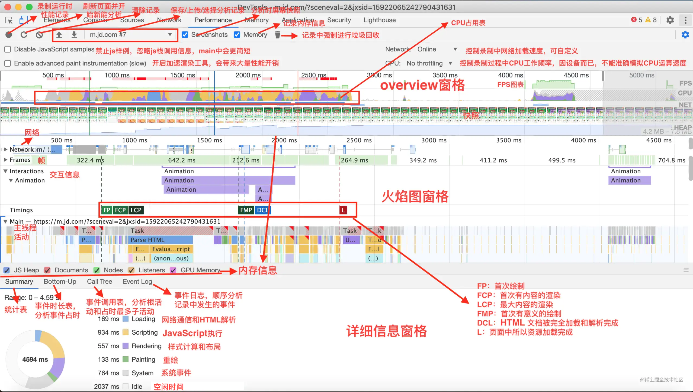
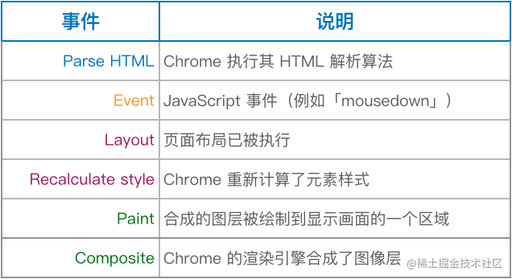

## 前端性能相关
### 如何分析前端性能


实际上的加载过程主要是三个阶段：
1. 导航阶段，该阶段主要是从网络进程接收 HTML 响应头和 HTML 响应体。
2. 解析 HTML 数据阶段，该阶段主要是将接收到的 HTML 数据转换为 DOM 和 CSSOM。
3. 生成可显示的位图阶段，该阶段主要是利用 DOM 和 CSSOM，经过计算布局、生成层树 (LayerTree)、生成绘制列表 (Paint)、完成合成等操作，生成最终的图片。



### 对性能的影响
1. 重排和重绘
一般情况下，样式的写操作之后，如果有下面这些属性的读操作，都会引发浏览器立即重新渲染。
- offsetTop/offsetLeft/offsetWidth/offsetHeight
- scrollTop/scrollLeft/scrollWidth/scrollHeight
- clientTop/clientLeft/clientWidth/clientHeight
- getComputedStyle()
比如如下的代码：
```js
div.style.color = 'blue';
// 第二步需要获取到元素的值，所以会强制重排.
var margin = parseInt(div.style.marginTop);
div.style.marginTop = (margin + 10) + 'px';
```
因此上诉的操作会导致两次重排，所以在书写的时候要尽量做到 读写分离。比如下面这种：
```js
div.style.left = div.offsetLeft + 10 + "px";
div.style.top = div.offsetTop + 10 + "px";
```
这种就是错误示范，因为浏览器自己会尽量把所有的变动集中在一起，排成一个队列，然后一次性执行，避免多次重新渲染。但是上面写法会使每一次写操作强制执行，因为里面有读操作，需要获取到当前的样式。

所以我们在使用到一些会引发重排，重绘的读操作时因该分开写。或者使用`requestAnimationFrame`将写操作推到下一帧执行
```js
function doubleHeight(element) {
  var currentHeight = element.clientHeight;
  element.style.height = (currentHeight * 2) + 'px';
}
elements.forEach(doubleHeight);
```


### will-change


## 前端优化思路
### webpack优化思路
**loader**
1. 不要让loader做太多事 （ include 或 exclude）
2. 增加缓存
```
loader: 'babel-loader?cacheDirectory=true'
```
**node_modules**
1. 使用`DllPlugin` 和 `DllReferencePlugin`，单独打包依赖库文件。只有依赖库文件版本变化才会重新打包
2. 使用 `HappyPack` 将loader变为多进程
- 在 Webpack 4 和 5 中，由于引入了多线程构建和缓存等性能优化功能，HappyPack 的作用已经不像以前那么显著了，大型项目或复杂项目中。可以通过使用 HappyPack 插件来提高构建速度和性能。

**按需加载**
有很多插件可以实现，核心内容为下：
```
require.ensure(dependencies, callback, chunkName)
```

### 图片优化

**图片格式理解**
jpg更适用色彩丰富的图片，适合做背景图，轮播图之类
png： 两种 png-8 和 png-24（在不影响清晰度的时候适当选择）

前端资源使用 cdn，并且使用的域名和后端接口不一样还可以避免不必要的 cookies 携带


### SSR
指的是服务器渲染前端代码。
因为类似，vue，react 这种虚拟dom 不适合浏览器查询（因为html结构都是js跑出来的），而搜索引擎不会去跑js脚本。所以提前先在服务器中渲染好了之后再给客户端。

好处：
1. 搜索引擎可查。
2. 渲染交给服务器后，提升性能。

### 浏览器渲染过程

#### css相关优化点
css的解析是从右到左进行的。
拿下面的例子举例来说，
`#myList li{}`  该选择器会先找到页面中所有的 `li` 标签，然后再去看是否父级为`#myList`。
因此最好的办法是：`.myList_li {}`

*-- 避免操作 dom 的次数 --*
1. 使用 `fragment`  -->  `let content = document.createDocumentFragment()`
2. 批量添加 css 属性  --> `container.classList.add('basic_style')`
3. dom 离线化优化，在大量引起回流操作的时候可以先用 `dispaly： none` 或者 `visibility: hidden` 先隐藏dom节点。
4. 


将渲染操作（修改dom的操作）包装成 `micro` 任务执行。原因为：当第一个宏任务 script执行完成之后，会去执行  `micro`  任务，此时将已经在js中操作完成的 dom 直接render 出来就好了，避免过多的dom操作。


---------------------
### webpack优化思路
**loader**
1. 不要让loader做太多事 （ include 或 exclude）
2. 增加缓存
```
loader: 'babel-loader?cacheDirectory=true'
```
**node_modules**
1. 使用`DllPlugin` 和 `DllReferencePlugin`，单独打包依赖库文件。只有依赖库文件版本变化才会重新打包
2. 使用 `HappyPack` 将loader变为多进程
- 在 Webpack 4 和 5 中，由于引入了多线程构建和缓存等性能优化功能，HappyPack 的作用已经不像以前那么显著了，大型项目或复杂项目中。可以通过使用 HappyPack 插件来提高构建速度和性能。

**按需加载**
有很多插件可以实现，核心内容为下：
```
require.ensure(dependencies, callback, chunkName)
```

### 图片优化

**图片格式理解**
jpg更适用色彩丰富的图片，适合做背景图，轮播图之类
png： 两种 png-8 和 png-24（在不影响清晰度的时候适当选择）

前端资源使用 cdn，并且使用的域名和后端接口不一样还可以避免不必要的 cookies 携带


### SSR
指的是服务器渲染前端代码。
因为类似，vue，react 这种虚拟dom 不适合浏览器查询（因为html结构都是js跑出来的），而搜索引擎不会去跑js脚本。所以提前先在服务器中渲染好了之后再给客户端。

好处：
1. 搜索引擎可查。
2. 渲染交给服务器后，提升性能。


### 浏览器渲染过程

#### css相关优化点
css的解析是从右到左进行的。
拿下面的例子举例来说，
`#myList li{}`  该选择器会先找到页面中所有的 `li` 标签，然后再去看是否父级为`#myList`。
因此最好的办法是：`.myList_li {}`

*-- 避免操作 dom 的次数 --*
1. 使用 `fragment`  -->  `let content = document.createDocumentFragment()`
2. 批量添加 css 属性  --> `container.classList.add('basic_style')`
3. dom 离线化优化，在大量引起回流操作的时候可以先用 `dispaly： none` 或者 `visibility: hidden` 先隐藏dom节点。
4. 


将渲染操作（修改dom的操作）包装成 `micro` 任务执行。原因为：当第一个宏任务 script执行完成之后，会去执行  `micro`  任务，此时将已经在js中操作完成的 dom 直接render 出来就好了，避免过多的dom操作。