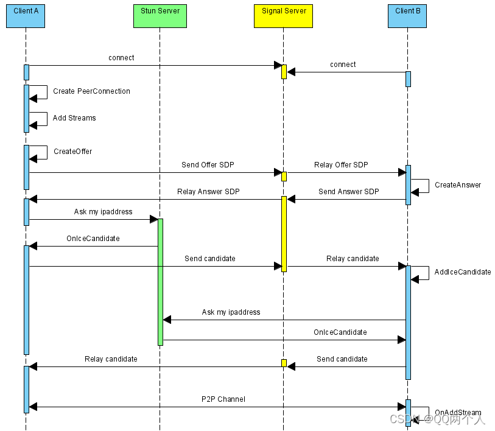
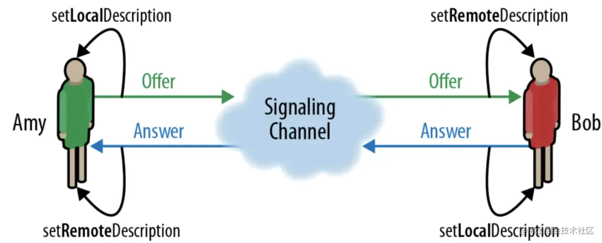

## 富文本编辑器


## 直播间


## search-table 组件


## 平时遇到的一些笔记📒
1. **判断有无传参，并对传参为 undefined 特殊处理**
```js
// 箭头函数无 arguments 参数
function fun(date) {
  if (Object.prototype.hasOwnProperty.call(arguments, '0')) { // 判断传参有无
    if (arguments[0] === undefined) { // 参数是否为空
      console.log(arguments[0]);
    }else {
      console.log(arguments[0]);
      return xxx(date)
    }
  } else {
    console.log('无传参数');
  }
} 
fun()          // 无传参数
fun(undefined) // undefined
fun('wewe')    // wewe
```

2. **加载网络图片使用 onload 不触发**
（缓存问题）解决方案, 怎么判断图片是否有缓存。
```js
// 同步加载图片
export function loadImage(src) {
  return new Promise(resolve => {
    const img = new Image()
    img.src = src
    img.style.display = 'none'
    document.body.appendChild(img)

    resolveImg(img, () => {
      document.body.removeChild(img)
      resolve(img)
    })
  })
}

// 判断图片是否加载完成
function resolveImg(img, callback) {
  if (img.complete) {
    callback()
  } else {
    setTimeout(() => resolveImg(img, callback), 50)
  }
}
```

3. **关于浮窗设计遇到的一些问题。**
- 3.1 浮窗设计一般不要和按钮设计在一起

4. **如何设置一个拖拽组件（放大，缩小）**

在设置拖拽组件的时候，很容易出现“拖掉”情况，这种时候一般就会采用事件委托，把事件委托给body。这里推荐另一种做法 setPointerCapture，这个功能可以确保一个元素可以持续的接收到一个 pointer 事件，即使这个事件的触发点已经移出了这个元素（比如，在滚动的时候）。
<resizeBox>
  <template #content>
    这是用来测试的文本内容
  </template>
</resizeBox>


5. **记录一些特殊数据**
小数加减的时候可以用来测试一下
- 0.1 + 0.2
- 19.9 * 100
- 32.3 * 100
- 0.56 * 100

6. **实现 h5 免提功能**
免提功能其实就对 输出设备（audiooutput）的切换，正常语音时是通过听筒输出声音，而免提功能则需要将输出设备切换至扬声器。

```js
// 获取媒体设备的方法：
navigator.mediaDevices.enumerateDevices().then(devices => {
  devices.forEach(device => {
    device.kind === 'audiooutput'     //找到扬声器设备
    speakerAudio.setSinkId(deviceId)  //通过 setSinkId 可以切换为扬声器
  })
})
```

到这里好像可以实现了，但是。经过 H5 页面测试，该方法是找不到听筒设备的，所以就能切换也切不回去了。

综上：还是要使用 `jsBridge` 直接调用原生方法去切换扬声器和听筒

## tab切换问题记载
**该方案 -- 对标于不对用户点击限制的情况下**
通常情况下：

我们会前端存储数据 使用了id -> 数据的映射关系，
```js
cacheInfo: {
   [id]: content: '',
}
```
**但是上面的方法会出现数据跳动的情况**

比如下面 Demo 我在1，2之间来回切换，其中2请求了5次（且5次的返回都很慢），然后可能会导致最后一次选中2后，右侧的数据还是在不断的变化，此时 一个loading状态记录是没用的，因为promise请求里面的 `loading = false` 操作 和 promise外面的 `loading = true`不是同步的，可能执行了3次true才返回了一次false的操作。

所以我们要记录每一次请求时loading的状态（可以用个数组记录）。当所有的loading都为false时，我的遮盖loading层才会取消掉。

cache数据结构如下所示：
```js
cacheInfo: {
  [id]: {
    loadingList: [true, false],
    content: ''
  }
}
```

关键函数如下：
```js
const rect = reactive({
  cardList: [1,2,3,4,5,6],
  curId: undefined,
  cacheInfo: {},
})

const changCard = (i:number) => {
  const mapping = { // 随机延迟时间
    1: 2000,
    2: 3000,
    3: 1000,
    4: 100,
    5: 6000,
    6: 50
  }
  rect.curId = i

  if (!rect?.cacheInfo[i]) rect.cacheInfo[i] = { loadingList: [], content: '' }
  rect.cacheInfo[i].loadingList.push(true)              // 依次加上loading状态
  const idx = rect.cacheInfo[i].loadingList.length - 1  // 记录当前loading状态的数组索引

  fetch(mapping[i], i).then(res => {
    rect.cacheInfo[i].content = res
    rect.cacheInfo[i].loadingList[idx] = false          // 修改该次请求的loading状态，为请求完成
  })
}
```

<tabCheack></tabCheack>

<em><strong> --- A thousand years later --- </strong></em>

但是上面的方法还会出现一个问题，对**同一个接口请求了多次后**，前后两次接口返回的时间可能是不一样的，也就是说会出现后一个先返回，**前一个后返回的情况**，这时展示的内容就不是最新的了。（但是这种一般情况下也不会有察觉，除非是对于时间要求很敏感的，刷新数据精确到秒）所以本质上解决的方案还是要限制对每一个单独卡片的请求，*即卡片1的第一次请求未完成，再次点击卡片1时，会提示等待，但是此时是**可以点击其它的卡片的***

<tabCheackFin/>

## 语音通话相关知识
>[推荐文章](https://runebook.dev/zh-CN/docs/dom/webrtc_api/signaling_and_video_calling)
>
>[webrtc-常用操作](https://github.com/webrtc/samples)
>
>[推荐Demo](https://juejin.cn/post/6884851075887661070)
>
>相关插件：JsSIP -- 插件

WebRTC 虽然支持端对端通信，但是这并不意味着 WebRTC 不再需要服务器。在点对点通信的过程中，双方需要交换一些元数据比如媒体信息、网络数据等等信息。我们通常称这一过程叫做：信令(signaling)。对应的服务器即信令服务器 (signaling server)。



**webRTC**
#### 获取音/视频 -- Network Stream API 网络流媒体接口
- 需要访问音/视频设备：
```js
// 返回一个 promise， 这里要注意浏览器兼容的问题
navigator.mediaDevices.getUserMedia(constraints);
// 检测设备枚举
navigator.mediaDevices.enumerateDevices()  //返回为Promise
```
- constraints 参数设置
```js
// 基础设置 - 不带任何参数的 音视频。
{ audio: true, video: true }
// 一些常用的参数设置
{
  "audio": {
    "echoCancellation": boolean,
    "noiseSuppression": boolean
  },  // 是否捕获音频
  "video": {  // 视频相关设置
    "width": {
      "min": "381", // 当前视频的最小宽度
      "max": "640" 
    },
    "height": {
      "min": "200", // 最小高度
      "max": "480"
    },
    "frameRate": {
      "min": "28", // 最小帧率
      "max": "10"
    }
  }
}
```

#### 开始连接 -- RTCPeerConnection WebRTC连接
A与B之间建立联系示意图：



```js
// 1. 创建 RTCPeerConnection 对象
let localPeerConnection = new RTCPeerConnection(servers)
let remotePeerConnection = new RTCPeerConnection(servers)
// 2. 创建 offer
localPeerConnection.createOffer(offerOptions).then(createdOffer)
// 3. A,B之间的开始交互
const createdOffer = (description) => {
  // 3.1 A 存储一份 A的offer
  localPeerConnection.setLocalDescription(description).then().catch()
  // 3.2 B 在服务端获取到之后
  // 3.2.1 B 存储一份 A的offer
  remotePeerConnection.setRemoteDescription(description).then().catch()
  // 3.2.2 B 创建 Answer
  remotePeerConnection.createAnswer().then(res => {
    // 同上 B 本地存储 setLocalDescription
    remotePeerConnection.setLocalDescription(res)
    // A 远端存储
    localPeerConnection.setRemoteDescription(res) 
    }
  )
}
```
至此 A，B 首次（端到端的链接）就建立完成了✅

#### 监听对话 --- RTCPeerConnection API
- `icecandidate`：当 RTCPeerConnection 通过 RTCPeerConnection.setLocalDescription() 方法更改本地描述之后，该 RTCPeerConnection 会抛出 icecandidate 事件。
- `iceconnectionstatechange`：在协商过程中，每次ICE连接状态发生变化时，都会向 RTCPeerConnection 对象发送一个 iceconnectionstatechange 事件。新的 ICE 连接状态在对象的 iceConnectionState 属性中可用。
- `track`：当新的轨道被添加到 RTCPeerConnection 时——通过调用它的 addTrack() 方法或者由于流格式的重新协商——一个 track 事件被设置到 RTCPeerConnection 为每个添加到连接的轨道。使用新添加的媒体需要为 track 事件实现一个处理程序。一个常见的需求是将传入的媒体附加到适当的 HTML 元素。

```js
// 1. 本地远端之间建立联系
localPeerConnection.addEventListener('icecandidate', handleConnection)
remotePeerConnection.addEventListener('icecandidate', handleConnection)
// -------------------------handleConnection--------------------------------------
function handleConnection(event) {
  const peerConnection = event.target;
  const iceCandidate = event.candidate;
  if (iceCandidate) {
    // 创建 RTCIceCandidate 对象
    const newIceCandidate = new RTCIceCandidate(iceCandidate);
    // 得到对端的 RTCPeerConnection
    const otherPeer = (peerConnection === localPeerConnection) ? remotePeerConnection : localPeerConnection;
    // 将本地获得的 Candidate 添加到远端的 RTCPeerConnection 对象中
    // 为了简单，这里并没有通过信令服务器来发送 Candidate
    otherPeer.addIceCandidate(newIceCandidate)
      .then(() => {
        handleConnectionSuccess(peerConnection);
      }).catch((error) => {
        handleConnectionFailure(peerConnection, error);
      });
}
// ------------------------------------------------------------------------------
// 2. 监控，在该 demo 中没有实际作用
localPeerConnection.addEventListener('iceconnectionstatechange', handleConnectionChange)
remotePeerConnection.addEventListener('iceconnectionstatechange', handleConnectionChange);

// 3. B通过监听 track，通过 video/audio 展示媒体流
remotePeerConnection.addEventListener('track', gotRemoteMediaStream);
function gotRemoteMediaStream(event) {
  if (remoteVideo.srcObject !== event.streams[0]) {
    remoteVideo.srcObject = event.streams[0];
    remoteStream = event.streams[0];
    console.log('remote 开始接受远端流')
  }
}
```

