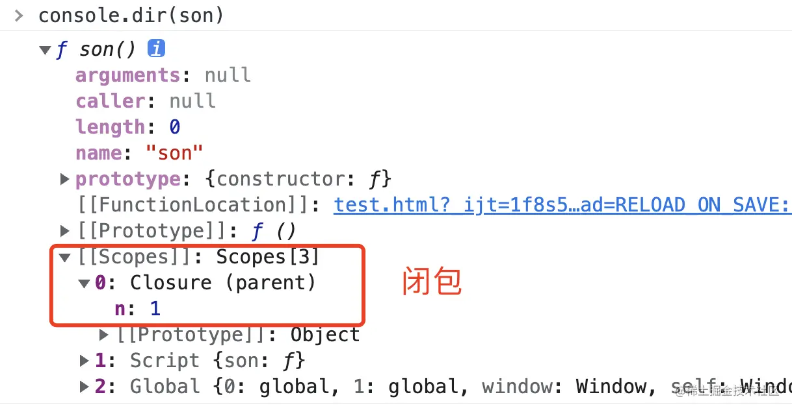

## 堆和栈
栈是一种先进后出（Last In First Out，LIFO）的数据结构，用于存储基本数据类型和方法调用时的参数、返回值和临时变量等。
栈的查找速度非常快，因为栈中的数据是连续存储的，可以通过指针直接访问。但是栈的大小是有限的，当栈的空间不足就会溢出。

堆：用于存储程序运行时动态分配的内存。堆的大小一般是不固定的，当程序需要动态分配内存时，就会在堆中分配一块内存空间，
并返回该空间的首地址，程序员可以手动控制该内存空间的使用和释放。堆的查找速度相对较慢，因为堆中的数据是分散存储的，需要通过指针进行访问


## 垃圾回收
前短需要掌握的是：
1. 垃圾回收 在v8引擎中是如何实现的，是怎样的一个流程。
2. 如何触发垃圾回收的机制，以及判断垃圾是否已经被回收。- 非可控流程
3. js的哪些操作容易导致无法触发垃圾回收机制。


简单来说 js 的垃圾回收机制是 v8 来实现的，并且使用了 并发，增量 的方式进行垃圾回收（以优化性能），也就是该过程中，前端开发者是不可控的。
因此，我们需要关注的点就是： 平时代码书写过程中会有哪些操作导致内存泄漏的问题，以及如何排查。


### 不正当的闭包
闭包的定义：
- JavaScript高级程序设计：闭包是指有权访问另一个函数作用域中的变量的函数
- JavaScript权威指南：从技术的角度讲，所有的JavaScript函数都是闭包：它们都是对象，它们都关联到作用域链
- 你不知道的JavaScript：当函数可以记住并访问所在的词法作用域时，就产生了闭包，即使函数是在当前词法作用域之外执行

闭包的实现：
原理：将闭包所需的数据，都存储到堆（Heap）上。

<br />
V8会将闭包所需的数据，存在函数的[[Scope]]的Closure 对象上，这个对象在堆（Heap）上。



- 使用完后赋值为null
```js
// -------------------- 闭包导致的内存泄漏 --------------------
function fn2(){
  let test = new Array(1000).fill('isboyjc')
  return function(){
    console.log(test)
    return test
  }
}
let fn2Child = fn2()
fn2Child()
fn2Child = null

// -------------------- 引用了 dom 节点但是没有移除 --------------------
let root = document.querySelector('#root')
let ul = document.querySelector('#ul')
let li3 = document.querySelector('#li3')

root.removeChild(ul) // 由于ul变量存在，整个ul及其子元素都不能GC
ul = null // 虽置空了ul变量，但由于li3变量引用ul的子节点，所以ul元素依然不能被GC
li3 = null // 已无变量引用，此时可以GC
```
- 清空计时器（`setTiemout`）
- 清空事件监听器（`removeEventListener`）


如何排查内存泄漏的问题： [文章参考](https://juejin.cn/post/6984188410659340324#heading-12)


new  简单变量

[两者区别](https://developer.aliyun.com/article/780342)

1. string 字面量的时候并没有内部 使用 new String().valueOf()
2. 当我们尝试访问一个原生值的属性时，JS引擎内部会调用一个内置[[toObject]] 方法，将字面量的”foo”转为一个[[PrimitiveValue]]为”foo”的String对象，然后从其原型链中尝试查找需要访问的属性，使用结束后再释放掉这个String对象。
这也就是为什么需要 new String 的原因。因为没有这个的话. 方法都.不出来

问题: 字面量是不是new 的简化
因该说是不同场景下创建变量的两种方式，比如你想给 某个 String 变量加一个方法叫ValueOf 那你直接使用字面量就无法实现
但是你只是存个值就没必要使用new 了，因为开销会更大
